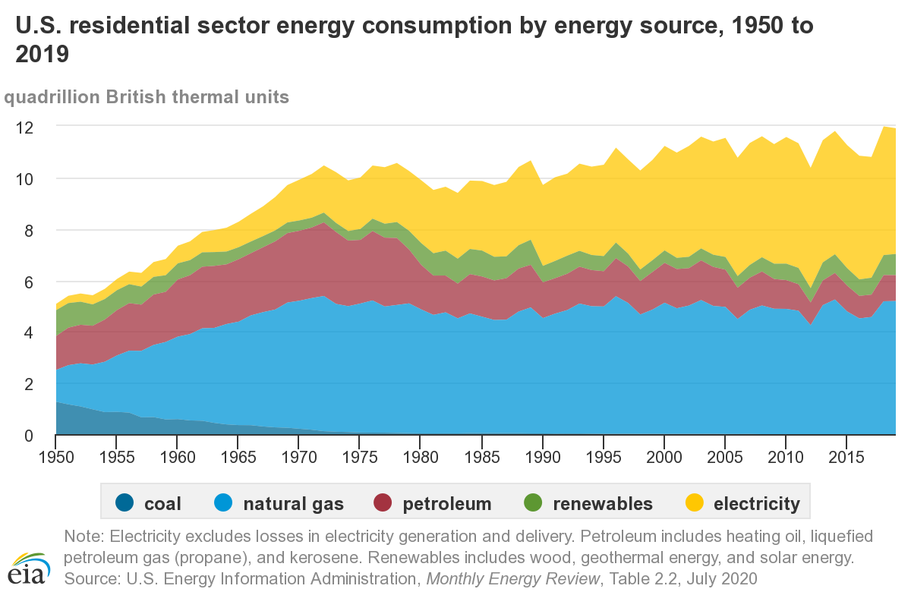

## Introduction

The consumption of petroleum in the United States has changed significantly over the past 45 years. There is surprising decline in US petroleum consumption (in Thousand Barrels per Day) by the residential sector. Here trend through years and seasonal components were extracted to gain a better understanding of change in petroleum consumption. Further, time series models were built using data from Jan 1984 to Sep 2018 and data from Oct 2018 to Sep 2019 were used to test which model did better in prediction.

## Materials and Methods

Data were downloaded from U.S. Energy Information Administration (eia) (https://www.eia.gov/totalenergy/data/monthly/index.php). DATA CATEGORIES >> Petroleum >> Residential and commercial sectors. Total Petroleum Consumed by the Residential Sector from Jan 1984 to Sep 2019 is extracted and used for time series analysis.

```{r echo=FALSE}
loadPkg = function(x) { if (!require(x,character.only=T, quietly =T)) { install.packages(x,dep=T,repos="http://cran.us.r-project.org"); if(!require(x,character.only=T)) stop("Package not found") } }

petroleum=read.csv("MER_T03_07A.csv")
petroleum <- petroleum[which(petroleum$MSN == 'PARCPUS'), ]
petroleum <- petroleum[which(petroleum$YYYYMM >= 198401), ]
# YYYY13 is the average of the year, so it's cleaned for time series analysis
Y <- 198413
while (Y < 201913) {
   petroleum <- petroleum[which(petroleum$YYYYMM != Y), ]
   Y = Y + 100
}
# "Value" is a factor. Need to use as.character before as.numeric.
petroleum$Value <- as.character(petroleum$Value)
petroleum$Value <- as.numeric(petroleum$Value)
y = petroleum[,"Value"]
y <- ts(y, start = c(1984, 1), frequency = 12)
n = length(y)
ts.plot(y,main = 'Petroleum Consumed by the Residential Sector',type = 'l',xlab = 'Time', ylab = 'Petroleu Comsumption')
```

1. The data contains petroleum consumed (in Thousand Barrels per Day) by the residential sector in the US from Jan, 1984 to Sep, 2019. 
In this case, the data is in a series of  particular time periods from Jan, 1984 to Sep, 2019. The trend and the seasonal effects can be estimated through the analysis, as well as the forcast of petroleum consumption. With these information, some adjustment to the global oil market can be made, such as reduction in oil production.

2. The variations in petroleum consumed seem to vary over the time. 

3. The time series is not stationary, as the series is not fluctuate about a constant value. Therefore transformation and estimation of the trend and the seasonal effects are needed in order to carry out the analysis. AS the graph of the time series falls to the left and rises to the right, then the degree for polynomial trend estimation should be odd. In addition, there are two peaks in the graph, so the degree of 5 for polynomial trend estimation was chosen.

The function 'trndseas' fits  a trend plus seasonal for the "best" Box-Cox transformation with a vector of lambda values: -1, -0.95, -0.90, ..., 0.95, 1. Then the best value of lambda, at which r-square is maximum, turns out to be equal to about 0.6. 
```{r include=FALSE}
trndseas=function(y,seas,lam,degtrnd){
  
# requires the R-package 'pracma'
  
# fits  a trend plus seasonal for the "best" Box-Cox 
# transformation.
  
# input: y, observed series; seas, seasons
  
# input: lam, the grid of Box-Cox transformations (lambda values)
  
# input: degtrnd, degree of the polynomial trend, if
# degtrnd=0, then the fitted trend is constant.
  
# output:  coef, regression coefficients - the
# first degtrnd+1 values for the trend part and the
# rest associated with the seasonals
  
# output: fit, fitted y-values; res, residuals,
  
# output: trend, fitted trend; season, fitted seasonals
  
# output: rsq, adjusted r-square values for different lambda in the
  
# output: lamopt, the value of lambda (among those supplied 
# in the vector lam) at which r-square is maximum.

m=length(lam)
n=length(y)

# Part of design matrix for estimating trend
if(degtrnd>0) {
   tm=seq(1/n,1,by=1/n)
   x1=poly(tm,degree=degtrnd,raw=TRUE)
   x1=cbind(rep(1,n),x1)
   } else {
    x1=as.matrix(rep(1,n),ncol=1)
   }

# Part of design matrix for estimating seasonality
x2=NULL
if(seas>1){
sn=rep(1:seas,length.out=n)
x2=factor(sn,levels=unique(sn),ordered=TRUE)
x2=model.matrix(~x2-1)
m2=ncol(x2)
m21=m2-1
x2=x2[,1:m21]-matrix(rep(x2[,m2],m21),ncol=m21,nrow=nrow(x2),byrow=F)
}

x=cbind(x1,x2)  # design matrix

xx=t(x)%*%x
rsq=rep(1,m)
m1=ncol(x1)     #degtrnd+1
m11=m1+1
mx=ncol(x)      # degtrnd+1+seas-1

for(i in 1:m) {
  if (lam[i]==0) {
    yt=log(y)
  } else {
    yt=y^lam[i]
   }
  xy=t(x)%*%yt
  coef=solve(xx,xy)
  fit=x%*%coef
  res=yt-fit
  ssto=(n-1)*var(yt)
  sse=t(res)%*%res
  rsq[i]=1-((n-1)/(n-mx))*sse/ssto
  }

  ii=which.max(rsq)
  lamopt=lam[ii]
  if (lamopt==0) {
    yt=log(y)
  } else {
    yt=y^lamopt
   }
  xy=t(x)%*%yt
  coef=solve(xx,xy)
  fit=x%*%coef
  trnd=x1%*%coef[1:m1]
  season=NULL
  if(seas>1){
  season=c(coef[m11:mx],-sum(coef[m11:mx]))
  }
  res=yt-fit

  result=list(coef=coef,fitted=fit,trend=trnd,residual=res,season=season,rsq=rsq,lamopt=lamopt)
  return(result)
}
```
```{r include=FALSE}
lam= seq(-1,1, by=0.05)
mod= trndseas(y, seas = 12,lam = lam, degtrnd = 5)
mod$lamopt
```
Then I fit a trend plus seasonal for the "best" Box-Cox transformation with a value of lambda equal to 0.6. 

Plots for the trend, seasonals and the rough after transformation are presented below.
```{r echo=FALSE}
month= 1:12
mod = trndseas(y, seas = 12,lam = 0.6,degtrnd = 5)
m.fit = mod$trend
m.fit <- ts(m.fit, start = c(1984, 1), frequency = 12)
ts.plot(y ^ .6, m.fit, main='Estimated Trend')
```

Plot of trend shows that there is a significant decline in petroleum consumed by the residential sector in the US since 2003. It remained stable or showed a slight increase since 2016. Overall, petroleum consumed by the residential sector in the US over last 15 years is less than two decades ago.



It shows electricity consumption increased significantly while petroleum consumption decrease. The significant decline in petroleum consumption could partially be explained by change in energy structure of residential sector in the US.

```{r echo=FALSE}
plot(month,mod$season,type='l',ylab='Seasonals',main='Estimated Seasonal Component')
```

Over a year, petroleum is consumed most in January and least in July, because Petroleum — fuel oil and propane (liquefied petroleum gas or LPG), together with nature gas, is all primarily used for space heating and water heating.

```{r echo=FALSE}
s.fit = rep(mod$season,length.out=n)
smooth.fit = mod$fit
x = y ^ .6 - m.fit - s.fit
plot(x,ylab ='', main='Estimated Rough Component')
```

### ARIMA model

Here I used the time series data from Jan 1984 to Sep 2018 to train models and data from Oct 2018 to Sep 2019 to test if the models perform well in prediction.

Notice that the rough component appears approximately stationary with no long-term trend: it exhibits a definite tendency to return to its mean, albeit somewhat lazy ones. 

The ACF plot confirms a slight amount of positive autocorrelation:

```{r echo=FALSE}
n2=n-12
x2=x[1:n2]
acf(x2)
pacf(x2)
```
```{r include=FALSE}
fit_0_0_0=arima(x2,order=c(0,0,0))
summary(fit_0_0_0)
```

Is difference needed? Because the amount of autocorrelation which remains is small, it appears as though the series may be satisfactorily stationary. If we try one order of differencing--i.e., an ARIMA(0,1,0) model--just to see what the effect is, we obtain the following time series plot:

```{r echo=FALSE}
fit_0_1_0=arima(x2,order=c(0,1,0))
res = fit_0_1_0$res
acf(res)
pacf(res)
```

```{r echo=FALSE}
summary(fit_0_1_0)
```

The ACF plot shows less autocorrelations. However the PACF plot shows more partial autocorrelations and the standard deviation has not changed much from `r fit_0_0_0$RMSE` to `r fit_0_1_0$RMSE`. Therefore, one order of differencing is not necessary.

Let's take another look at the ACF and PACF plot:

```{r echo=FALSE}
acf(x2)
pacf(x2)
```

Notice that (a) the correlation at lag 1 is significant and positive, and (b) the PACF shows a sharper "cutoff" than the ACF. The series appears slightly "underdifferenced", so I consider adding an AR term to the model. In particular, the PACF has only one significant spikes, while the ACF has four. The lag at which the PACF cuts off is the indicated number of AR terms. Thus, the rough components display an AR(1) signature. If we therefore set the order of the AR term to 1--i.e., fit an ARIMA(1,0,0) model--we obtain the following ACF and PACF plots for the residuals:

```{r echo=FALSE}
fit_1_0_0=arima(x2,order=c(1,0,0))
summary(fit_1_0_0)
res = fit_1_0_0$res
acf(res)
pacf(res)
Box.test(res,lag=20,'Ljung-Box')
```

The Ljung-Box test shows that the autocorrelations of ARIMA(1,0,0) are significantly different from zeros, so more AR and/or MA terms need to be included. However, as it is possible for an AR term and an MA term to cancel each other's effects, so ARIMA models cannot be identified by "backward stepwise" approach. In other words, we cannot begin by including several terms of each kind and then throwing out the ones whose estimated coefficients are not significant. Instead, we normally follow a "forward stepwise" approach, adding terms of one kind or the other as indicated by the appearance of the ACF and PACF plots. 

```{r echo=FALSE}
fit_2_0_2=arima(x2,order=c(2,0,2))
summary(fit_2_0_2)
res = fit_2_0_2$res
acf(res)
pacf(res)
Box.test(res,lag=20,'Ljung-Box')
hist(res)
```

The ARIMA model fitted would be ARIMA(2,0,2), following the "forward stepwise" approach.

The ACF and PACF plots show that autocorrelations and partial autocorrelations are within the significant bounds, though some touch and exceed the significant bounds, which could creat suspect whether they're significant or not. The Ljung-Box test rejects the hypothesis that the autocorrelations are significantly different from zeros. Overall, the residuals of ARIMA(2,0,2) resemble white noise, so the model seems to be a good fit.

```{r echo=FALSE}
h=12
m.fc=m.fit[-(1:n2)]
s.fc=s.fit[-(1:n2)]
fcast = predict(fit_2_0_2,n.ahead=h)
x.fc = fcast$pred
y.fc = m.fc + s.fc + x.fc
de_tran_y.fc=y.fc^(1/0.6)
y = petroleum[,"Value"]
plot.ts(y,xlim=c(0,n2+h))
points(x=n2+1:h, y=de_tran_y.fc, col='purple',type='b',pch=19)
loadPkg("Metrics")
```

```{r echo=FALSE}
loadPkg("data.table")
data.table(true = y[-(1:n2)], predict = de_tran_y.fc, diff = y[-(1:n2)]-de_tran_y.fc)
```

RMSE of using ARIMA model is ```r rmse(y[-(1:n2)], de_tran_y.fc)```.

### Holt-Winters model

```{r echo=FALSE}
petroleum <- petroleum[which(petroleum$YYYYMM <= 201809), ]
train = petroleum[,"Value"]
train <- ts(train, start = c(1984, 1), frequency = 12)
HW <- HoltWinters(train)
loadPkg("forecast")
HWfc <- forecast(HW, h=12)
loadPkg("highcharter") # to use hchart function
hchart(HWfc)
data.table(true = y[-(1:n2)], predict = HWfc$mean, diff = y[-(1:n2)] - HWfc$mean)
```

RMSE of using Holt-Winters model is ```r rmse(y[-(1:n2)], HWfc$mean)```.

```{r echo=FALSE}
data.table(this_year = y[-(1:n2)], last_year = y[-c(1:(n2-12), n2+1:n)], diff = y[-(1:n2)] - y[-c(1:(n2-12), n2+1:n)])
```

However, if we assume that petroleum consumed from Oct 2018 to Sep 2019 is the same as from Oct 2017 to Sep 2018, RMSE would be ```r rmse(y[-(1:n2)], y[-c(1:(n2-12), n2+1:n)])```.

## Results

Holt-Winters model did best in prediction.

```{r echo=FALSE}
HW
```

The estimated values of alpha, beta and gamma are ```r HW$alpha```, ```r HW$beta``` and ```r HW$gamma``` respectively. The value of alpha is relatively low, indicating that the estimate of the level at the current time point is based upon both recent observations and some observations in the more distant past. The value of beta is 0.00, indicating that the estimate of the slope b of the trend component is not updated over the time series, and instead is set equal to its initial value. This makes good intuitive sense, as the level changes quite a bit over the time series, but the slope b of the trend component remains roughly the same. The value of gamma is low also, indicating that the estimate of the seasonal component at the current time point is based upon both recent observations and some observations in the more distant past. 

## Conclusion and Discussion

There is a significant decline in petroleum consumed by the residential sector in the US since 2003. It remained stable or showed a slight increase since 2016. Overall, petroleum consumed by the residential sector in the US over last 15 years is less than two decades ago.

Over a year, petroleum is consumed most in January and least in July, because Petroleum — fuel oil and propane (liquefied petroleum gas or LPG), together with nature gas, is all primarily used for space heating and water heating.

Holt-Winters model did best in forecasting petroleum consumed from Oct 2018 to Sep 2019 based on the data from Jan, 1984 to Sep 2018.
